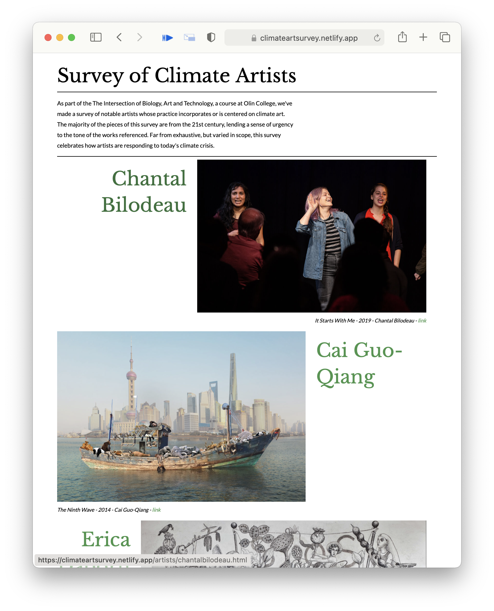

# Survey of Climate Artists
*By Annie Tor and Dieter Brehm*

As part of the The Intersection of Biology, Art and Technology, a course at Olin College, we've made a survey of notable artists whose practice incorporates or is centered on climate art. The majority of the pieces of this survey are from the 21st century, lending a sense of urgency to the tone of the works referenced. Far from exhaustive, but varied in scope, this survey celebrates how artists are responding to today's climate crisis.

